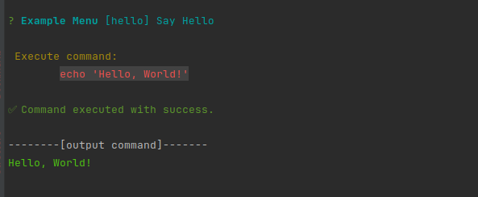

# Custom Menu CLI




Esta é uma ferramenta de interface de linha de comando (CLI) que cria um menu interativo com base em um arquivo JSON. Ele foi projetado para simplificar a execução de comandos frequentes em um terminal.

## Funcionalidades

- Menu interativo no terminal.
- Estrutura do menu definida por um arquivo JSON.
- Fácil de configurar e usar.
- Suporte para execução de comandos com confirmação.


## Lançamentos

Você pode encontrar todas as versões lançadas e os executáveis standalone pré-compilados na página de [Releases do GitHub](https://github.com/mateusmed/custom-menu-cli/releases).


## Instalação

Para instalar esta ferramenta globalmente, execute o seguinte comando:

```bash
npm install -g custom-menu-cli
```

## Uso

Existem três maneiras principais de utilizar esta ferramenta:

### 1. Como Executável (Build de Release)

Você pode gerar executáveis para Linux, macOS e Windows. Após o build, os arquivos estarão na pasta `dist/`.

Primeiro, gere os arquivos com o comando:

```bash
npm run build
```

Depois, execute o arquivo correspondente ao seu sistema operacional, passando opcionalmente o caminho para um arquivo de menu. Se nenhum caminho for fornecido, ele procurará por um `menu.json` no diretório atual.

```bash
# No Linux/macOS
./dist/custom-menu-linux [caminho/para/seu/menu.json]

# No Windows
.\dist\custom-menu-win.exe [caminho\para\seu\menu.json]
```

### 2. Globalmente via NPM

Instale o pacote globalmente para usar o comando `custom-menu-cli` em qualquer lugar do seu sistema.

```bash
npm install -g custom-menu-cli
```

Depois de instalado, execute o comando:

```bash
custom-menu-cli [caminho/para/seu/menu.json]
```

### 3. Programaticamente via `require`

Você pode importar a função `runCli` em seus próprios projetos Node.js para integrar a funcionalidade do menu.

Primeiro, adicione o pacote como uma dependência do seu projeto:
```bash
npm install custom-menu-cli
```

Depois, use-o em seu código:

```javascript
const { runCli } = require('custom-menu-cli');

async function iniciarMeuMenuCustomizado() {
    console.log("Iniciando menu customizado...");
    // Opcionalmente, passe o caminho para o seu arquivo menu.json
    await runCli('./caminho/para/seu/menu.json');
    console.log("Menu customizado finalizado.");
}

iniciarMeuMenuCustomizado();
```

## Estrutura do JSON

O arquivo JSON que define o menu tem a seguinte estrutura:

```json
{
  "name": "Deploy Menu",
  "description": "Menu de navegação para deploys",
  "options": [
    {
      "id": "1",
      "name": "Projeto A",
      "type": "navigation",
      "options": [
        {
          "id": "1.1",
          "name": "Down Service",
          "type": "action",
          "command": "echo 'Down A'",
          "confirm": true
        },
        {
          "id": "1.2",
          "name": "Up Service",
          "type": "action",
          "command": "echo 'Up A'"
        }
      ]
    },
    {
      "id": "2",
      "name": "Restart All",
      "type": "custom-action",
      "idList": ["1.1", "1.2"],
      "confirm": true
    }
  ]
}
```

### Campos

- `name`: O nome do menu.
- `description`: Uma breve descrição do menu.
- `options`: Um array de opções do menu.
  - `id`: Um identificador único para a opção.
  - `name`: O texto que será exibido para a opção.
  - `type`: O tipo de opção. Pode ser `action` (executa um comando), `navigation` (abre um submenu) ou `custom-action` (executa uma lista de comandos de outras ações).
  - `command`: O comando a ser executado (se o tipo for `action`).
  - `idList`: Uma lista de ids de outras ações a serem executados (se o tipo for `custom-action`).
  - `confirm`: Um booleano que indica se uma confirmação deve ser solicitada antes de executar o comando.
  - `options`: Um array de sub-opções (se o tipo for `navigation`).

## Licença

Este projeto está licenciado sob a Licença MIT.

## Autor

- **Mateus Medeiros**
  - GitHub: [@mateusmed](https://github.com/mateusmed)
  - LinkedIn: [Mateus Medeiros](https://www.linkedin.com/in/mateus-med/)
